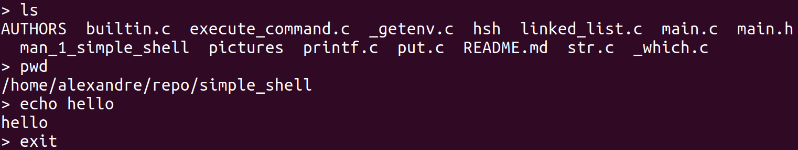

# 0x16. C - Simple Shell



## Installation and Usage

This project was realised on **Ubuntu 20.04 LTS** and compiled with **GCC 9.4.0**. Depending on the changes, it may not work on future version. If you want to download and test our project, follow these steps:

```
$ git clone git@github.com:adut24/simple_shell.git
$ cd simple_shell
$ gcc -Wall -Werror -Wextra -pedantic -std=gnu89 *.c -o hsh
$ ./hsh
>
```

## Read the man page
To read the man of the simple shell, use the command `man ./man_1_simple_shell` in the terminal when you are inside the repository.

## Description
The Simple Shell is the second team project realised in Holberton School. The purpose is to replicate the shell (`sh`) present in Linux. The shell takes different prompts and interprets them to execute them.

## Output
This simple shell works in "interactive mode":
```
$ ./hsh
> /bin/ls
hsh main.c shell.c
```

As well as in "non-interactive mode":
```
$ echo "ls" | ./hsh
hsh main.c shell.c
$ cat test_ls_2
ls
ls
$ cat test_ls_2 | ./hsh
hsh main.c shell.c
hsh main.c shell.c
```

## Specifications present
| Specification | Description |
| --- | --- |
| `/bin/ls` | Command executed by putting the path of it |
| `pwd` | Command executed by just putting the command |
| `ls -l` | Handle arguments to the command |
| `exit [status]` | Built-in to exit with a specific status |
| `env` | Built-in to print all the environment variables |
| `#` | Comments |

## Examples
```
$ ./hsh
> pwd
/home/alexandre/repo/simple_shell
> ^C
> ls -l main.c
-rw-rw-r-- 1 alexandre alexandre 2567 avril 13 15:26 main.c
```

## Tasks
Here are all the tasks of this project:

### 0. README, man, AUTHORS
* Write a [README](https://github.com/adut24/simple_shell/blob/main/README.md)
* Write a [man](https://github.com/adut24/simple_shell/blob/main/man_1_simple_shell) for your shell.
* You should have an [AUTHORS](https://github.com/adut24/simple_shell/blob/main/AUTHORS) file at the root of your repository, listing all individuals having contributed content to the repository.

### 1. Betty would be proud
Write a beautiful code that passes the Betty checks.

### 2. Simple shell 0.1
Your Shell should:

* Display a prompt and wait for the user to type a command. A command line always ends with a new line.
* The prompt is displayed again each time a command has been executed.
* The command lines are simple, no semicolons, no pipes, no redirections or any other advanced features.
* The command lines are made only of one word. No arguments will be passed to programs.
* If an executable cannot be found, print an error message and display the prompt again.
* Handle errors.
* You have to handle the “end of file” condition (`Ctrl+D`)

### 3. Simple shell 0.2
Handle command lines with arguments.

### 4. Simple shell 0.3
* Handle the `PATH`
* fork must not be called if the command doesn’t exist

### 5. Simple shell 0.4
* Implement the `exit` built-in, that exits the shell
* Usage: `exit`
* You don’t have to handle any argument to the built-in `exit`

### 6. Simple shell 1.0
Implement the `env` built-in, that prints the current environment

### 7. What happens when you type `ls -l *.c` in the shell
Write a blog post describing step by step what happens when you type `ls -l *.c` and hit Enter in a shell. Try to explain every step you know of, going in as much details as you can, give examples and draw diagrams when needed. You should merge your previous knowledge of the shell with the specifics of how it works under the hoods (including syscalls).
* Have at least one picture, at the top of the blog post
* Publish your blog post on Medium or LinkedIn
* Share your blog post at least on LinkedIn
* Only one blog post by team
* The blog post must be done and published before the first deadline (it will be part of the manual review)
* Please, remember that these blogs must be written in English to further your technical ability in a variety of settings

### 8. Test suite
Contribute to a test suite for your shell.

This is a task shared by everyone in the class.

* Every team (who contributed) will get the same score for this task (The repository owner will not get more points)
* You have to be pro-active and agree on one and unique repository to use for the test suite
* Please provide the link to the repository you contributed to
* Your contribution must be relevant (Correcting typos is nice and always appreciated on the open source sphere, but we won’t consider this a contribution at this point, unless it fixes a bug)

Guidelines for your test suite repository:

* The test suite should cover every tasks from `0.` to `20.`
* The test suite should cover every regular cases (many different examples) and possible edge cases
* The entire class should work on the same test suite. Use only one repository (don’t forget the `README.md` file)
* Start adding tests ASAP and not just before the deadline in order to help everyone from day 0
* You can take (or fork) inspiration from [this example](https://github.com/holbertonschool/0x15.c/), but it is not mandatory to follow this format/way
* Adopt a style and be consistent. You can, for example, follow this [style guide](https://google.github.io/styleguide/shellguide.html). If you choose a style that already exists, add it to the `README.md` in a style section. If you write your own, create a Wiki page attached to the project and refer to it in the `README.md` style section.
* You should have an `AUTHORS` file, listing all individuals having contributed content to the repository.

### 9. Simple shell 0.1.1
Starting from this point, you have to manage the env and forward it to your `execve`
* Write your own `getline` function
* Use a buffer to read many chars at once and call the least possible the read system call
* You will need to use static variables
* You are not allowed to use `getline`

### 10. Simple shell 0.2.1
You are not allowed to use `strtok`.

### 11. Simple shell 0.4.1
* Handle arguments for the built-in `exit`
* Usage: `exit status`, where status is an integer used to `exit` the shell

### 12. Simple shell 0.4.2
Handle `Ctrl+C`: your shell should not quit when the user inputs `^C`.

### 13. setenv, unsetenv
Implement the `setenv` and `unsetenv` builtin commands
* `setenv`:
	* Initialize a new environment variable, or modify an existing one
	* Command syntax: `setenv VARIABLE VALUE`
	* Should print something on stderr on failure
* `unsetenv`:
	* Remove an environment variable
	* Command syntax: `unsetenv VARIABLE`
	* Should print something on stderr on failure

### 14. cd
Implement the builtin command `cd`:
* Changes the current directory of the process.
* Command syntax: `cd [DIRECTORY]`
* If no argument is given to `cd` the command must be interpreted like `cd $HOME`
* You have to handle the command `cd -`
* You have to update the environment variable PWD when you change directory

### 15. ;
Handle the commands separator `;`.

### 16. && and ||
Handle the `&&` and `||` shell logical operators.

### 17. alias
* Implement the `alias` builtin command
* Usage: `alias [name[='value'] ...]`
	* `alias`: Prints a list of all aliases, one per line, in the form name='value'
	* `alias name [name2 ...]`: Prints the aliases `name`, `name2`, etc 1 per line, in the form `name='value'`
	* `alias name='value' [...]`: Defines an alias for each `name` whose `value` is given. If `name` is already an alias, replaces its value with `value`

### 18. Variables
* Handle variables replacement
* Handle the `$?` variable
* Handle the `$$` variable

### 19. Comments
Handle comments (`#`).

### 20. help
* Implement the `help` built-in
* Usage: `help [BUILTIN]`

### 21. history
* Implement the `history` built-in, without any argument
* The `history` built-in displays the history list, one command by line, preceded with line numbers (starting at `0`)
* On `exit`, write the entire history, without line numbers, to a file named `.simple_shell_history` in the directory `$HOME`
* When the shell starts, read the file `.simple_shell_history` in the directory `$HOME` if it exists, and set the first line number to the total number of lines in the file modulo `4096`

### 22. File as input
* Usage: `simple_shell [filename]`
* Your shell can take a file as a command line argument
* The file contains all the commands that your shell should run before exiting
* The file should contain one command per line
* In this mode, the shell should not print a prompt and should not read from `stdin`

## Authors

* [Pierre DUREAU](https://github.com/Pierre-Dureau) - dureaupierre53@gmail.com
* [Mustapha ABOURAR](https://github.com/Devmustroc) - 4250@holbertonschool.com
* [Alexandre DUTERTRE](https://github.com/adut24) - dutertre.alexandre@laposte.net
